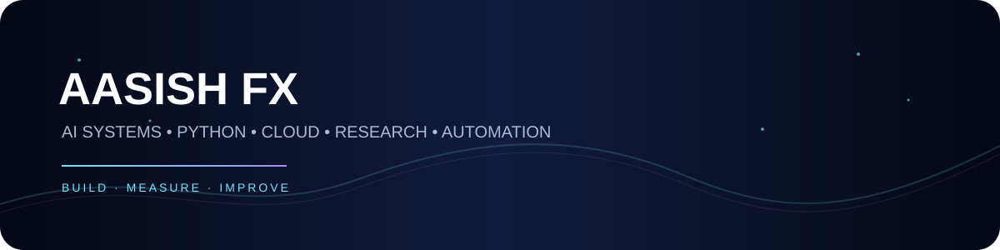
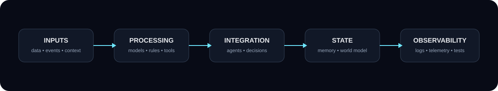

 

### Aasish Kumar Choudhary · **Aasish FX**

**AI systems • Python • AWS • Automation • Technical Research**

---

## ⚡ What I build

I work on **software systems, AI infrastructure and experimental engineering** — with an emphasis on making systems understandable, observable and reproducible.

My interests sit at the intersection of:

| 🧠 AI & Cognition | ⚙️ Engineering | ☁️ Cloud & Automation |
|---|---|---|
| AI agents | Python | AWS Lambda |
| LLM systems | APIs | S3 |
| Cognitive architectures | Data pipelines | Serverless systems |
| Agent orchestration | Testing & telemetry | Automation |
| Persistent state | GitHub workflows | Deployment |

---

## 🧩 Selected Work

### 🟣 Project Gold
A research-oriented systems program exploring a persistent cognitive architecture for AI.

**Focus:** memory • persistent state • specialist processing • global-state integration • event-driven communication • telemetry • provenance • agent orchestration

### 🔵 AI / Agent Engineering
Experiments around evidence-first AI-assisted development, execution workflows and observable system state.

**Focus:** planning → execution → evidence → validation → iteration

### 🟠 AWS / Serverless
Hands-on engineering with cloud-native building blocks and deployed services.

**Focus:** Lambda • S3 • APIs • serverless deployment • system integration

### 🟢 SAR Ground Control UI
A software-only interface concept for search-and-rescue operations.

**Focus:** mission visualization • telemetry dashboards • sensor presentation • operator workflow

> *Simulation/UI work only — not a real-world flight-control system.*

---

## 🏗️ Systems mindset

I prefer architectures where important behaviour can be **inspected, tested and explained**.

That means:

- **Deterministic foundations** where possible
- **Observable state** instead of hidden assumptions
- **Modular components** that can be tested independently
- **Evidence and provenance** for important outputs
- **Clear separation** between experiments and verified behaviour

---

## 🛠️ Technical Stack

### Languages
Python • JavaScript • HTML • CSS • Shell

### AI & Systems
AI Agents • LLM Systems • Cognitive Architectures • Agent Orchestration • Persistent State • Telemetry • Observability

### Cloud & Software
AWS • Lambda • S3 • APIs • Automation • Data Pipelines • GitHub • Serverless

### Engineering Approach
System Design • Experimentation • Testing • Documentation • Evidence-First Research

---

## 📌 Engineering principles

> **Build it. Instrument it. Test it. Understand it.**

I care less about making a prototype *look intelligent* and more about making the underlying system **measurable, reproducible and improvable**.

---

## 🎯 Current direction

    AI SYSTEMS
        │
        ├── Agents & orchestration
        ├── Persistent state & memory
        ├── Cognitive architectures
        ├── Tool / API integration
        ├── Telemetry & observability
        └── Reproducible experimentation

---

## 🤝 Open to

**Freelance • Research • AI automation • Python development • AWS/serverless • Technical prototyping • Systems engineering**

If a project needs someone who can move from **idea → architecture → implementation → testing → documentation**, let's build it.

---

### AASISH FX

*Engineering intelligent systems with measurable foundations.*

 

